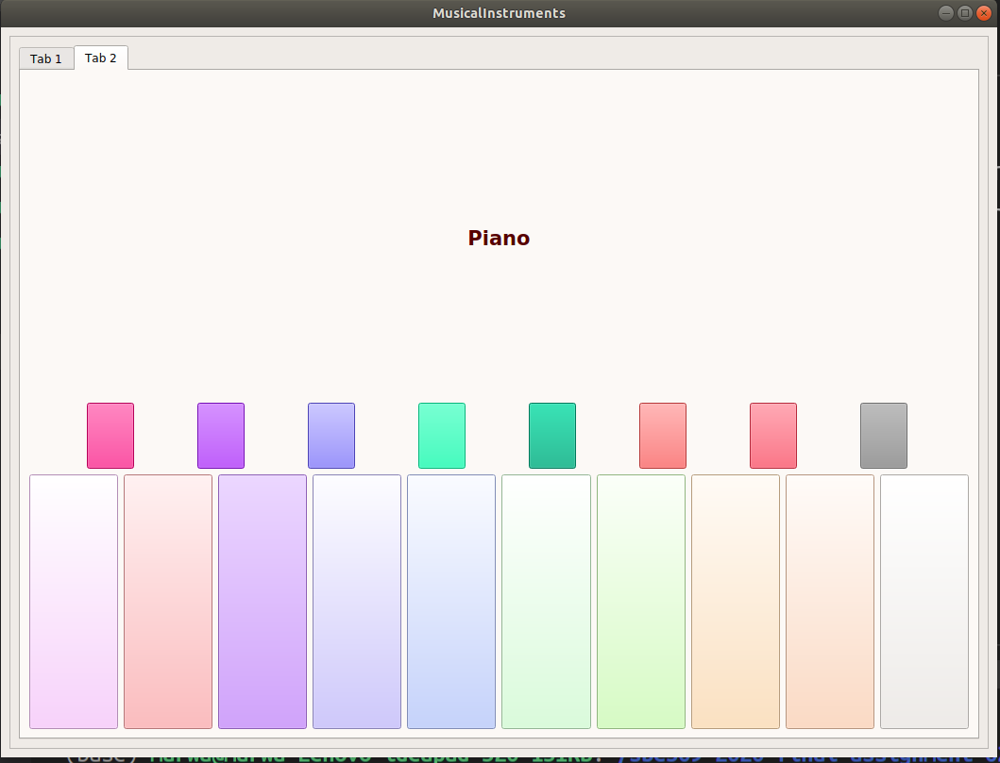
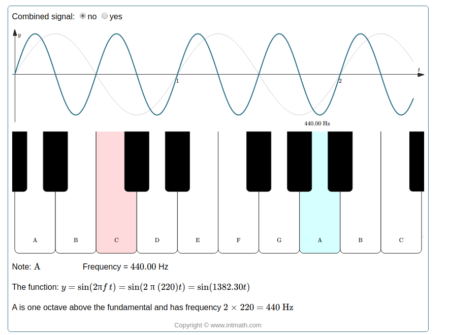
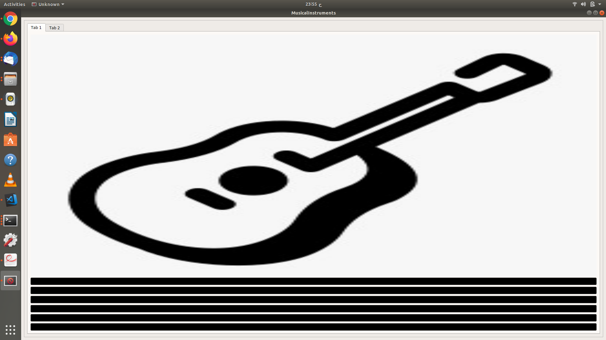

# Problem 3
### In this problem we are required to make 2 different instrument sounds , so we chose "Piano" and "Guitar".

## <b> Piano </b>

</ul>

### Here we used simple equation to generate piano sound.

</ul>

#### In the previous figure is the equation used and frequencies to generate piano sound for different keys for further details please visit :

* [Piano src](https://www.intmath.com/trigonometric-graphs/music-note-frequencies-interactive.php)

## <b> Guitar </b>

### In This Part we used different code that depend on pitch,stretch factor and sampling frequency .

> 
</ul> 

> You can play guitar strings from the strings under the guitar picture .

### Enjoy!